 

 

  

<picture>
  <source
    media="(prefers-color-scheme: dark)"
    srcset="https://raw.githubusercontent.com/s-tsonidis/s-tsonidis/output/github-contribution-grid-snake-dark.svg"
  />
  <source
    media="(prefers-color-scheme: light)"
    srcset="https://raw.githubusercontent.com/s-tsonidis/s-tsonidis/output/github-contribution-grid-snake.svg"
  />
  
</picture>

